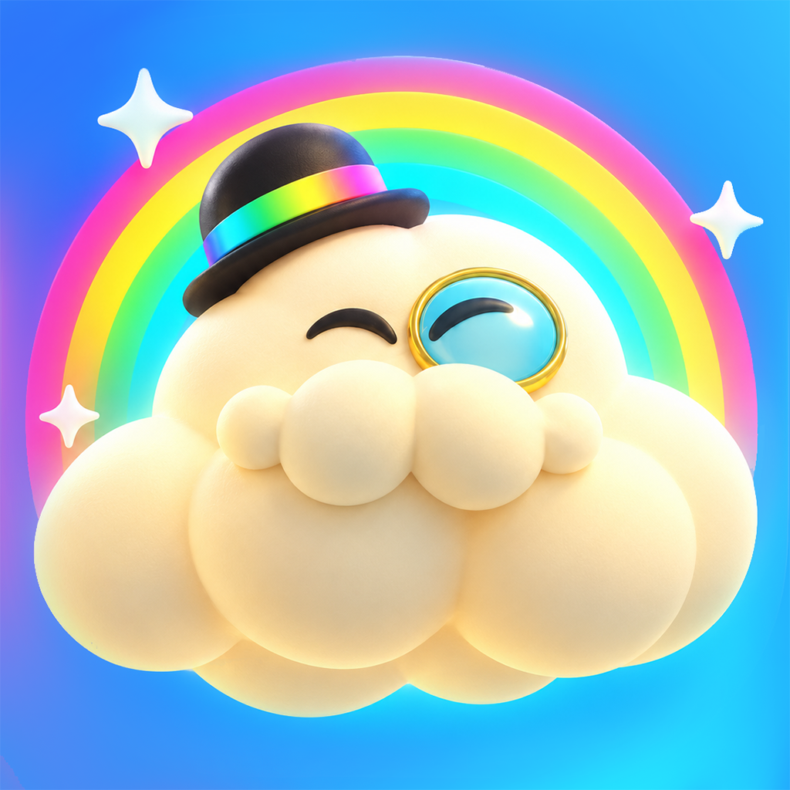
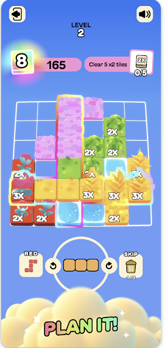
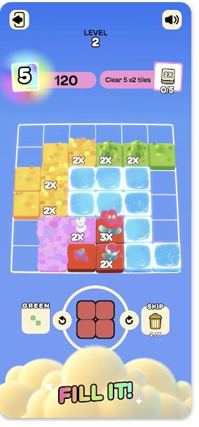
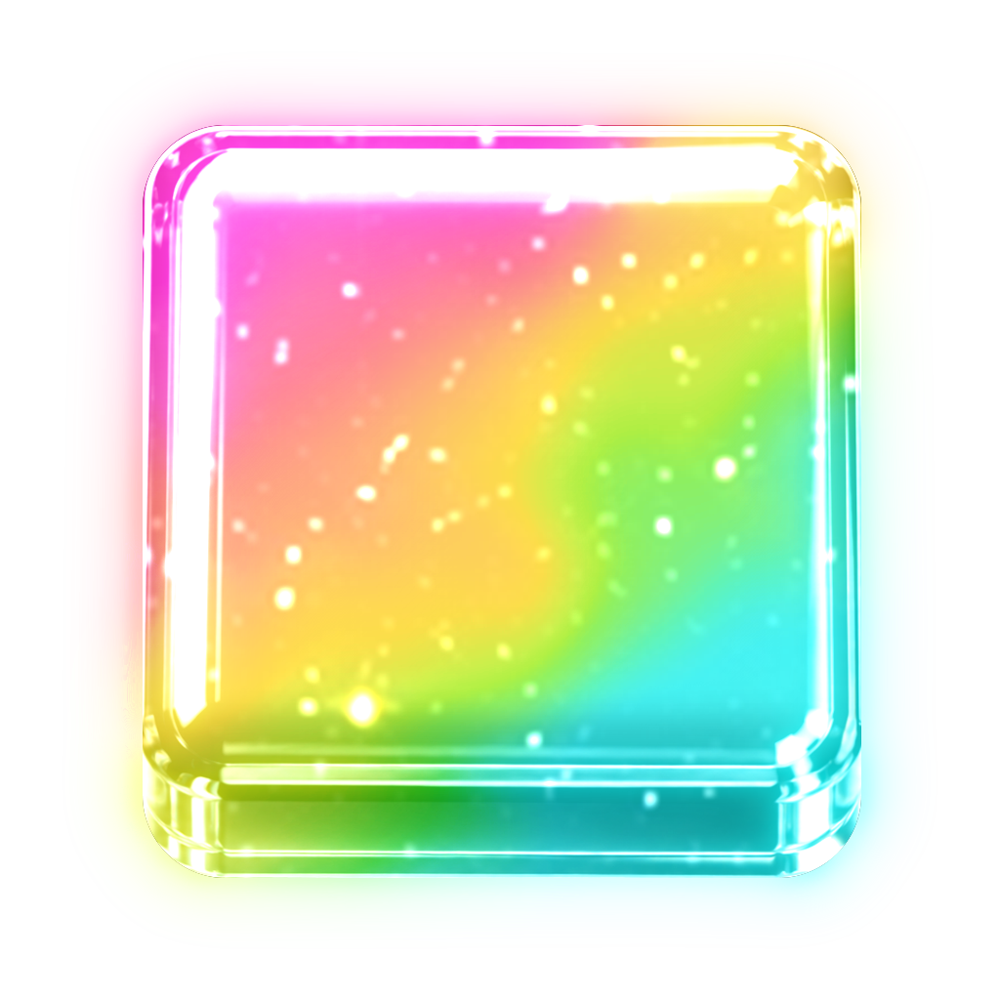
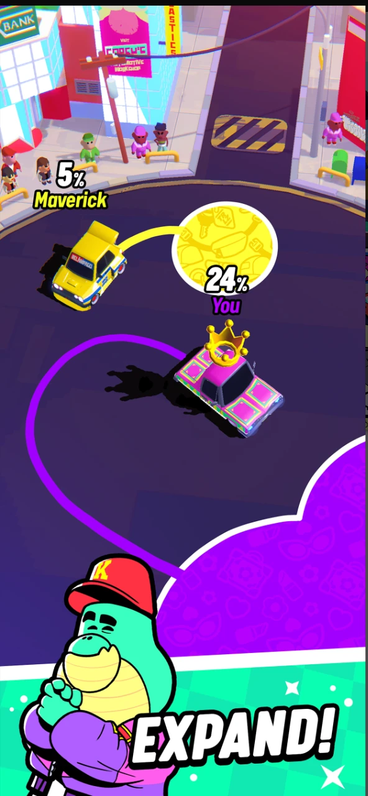
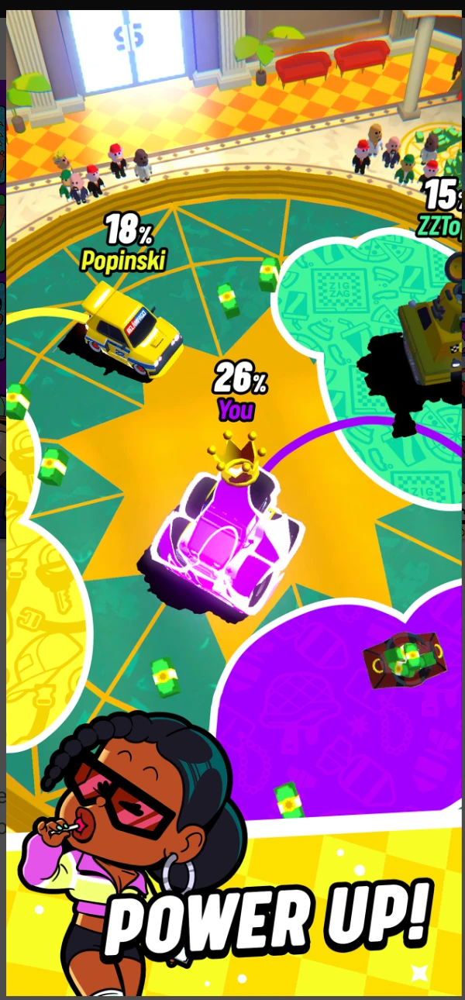

# Projects — Uri Katz

## LoopheadsCore — Shared game platform (foundation for all titles below)

- Designed and maintain a suite of **17 Unity UPM packages** (`com.loopheads.*`) providing one shared core for every Lootheads game: **Nakama** transport, account/auth, **Unity IAP** commerce, **ads mediation**, push notifications, iOS **deep links** & **ATT**, analytics, and editor tooling.
- Enforced quality with a headless validation project (compile + EditMode tests) gating every package release, so features ship once and land in all games.

---

##  BlockyBlock — Real-time multiplayer block-puzzle game

*Live on **App Store** & **Google Play***

- Architected a **Unity 6** (C#, **Zenject**, **UniTask**) client on **LoopheadsCore** and an authoritative **Go** / **Nakama** server on **PostgreSQL** + **Redis**, hosted on **OVHcloud** and containerized with **Docker**.
- Designed a deterministic shared rules engine consumed by both client and server, with **Protobuf**/**gRPC** contracts and golden test vectors guaranteeing zero client/server drift.
- Built the analytics pipeline into **ClickHouse** with **Grafana** dashboards for real-time product and server metrics; integrated **Firebase Crashlytics**, **AppsFlyer**, **Singular**, **Adjust**, **Amplitude**, and **AdMob**.
- Owned CI/CD and store releases: automated Go + Unity EditMode tests, iOS/Android pipelines on self-hosted runners, **App Store** (TestFlight, dSYM symbolication) and **Google Play** publishing; content via **Unity Addressables**.

  
  

---

##  SortBlastWorlds — Sort-puzzle game

*Live on **App Store** & **Google Play***

- Shipped a second title on the same **LoopheadsCore** + **Nakama** / **Go** stack, reusing the shared client packages, server infrastructure, **ClickHouse** + **Grafana** analytics, and attribution SDKs (**AppsFlyer**, **Singular**, **Adjust**, **Amplitude**) — proving the platform's multi-game reuse.

---

## Trailblazers — Multiplayer Unity game

*Live on **App Store** & **Google Play***

- Created a **Roslyn** incremental **source-generator** + **analyzer** toolkit that auto-wires the event system from attributes (`[OnLocalPlayer]`, `[OnInsideBucket]`, …), replacing boilerplate and turning wiring bugs into compile errors.
- Integrated **PlayFab** for player accounts/live-ops and **Singular** for attribution.

  
  

---

## Backend Azure Functions — Serverless game backend

- Built **Azure Functions** (**.NET isolated**) APIs on **Azure Cosmos DB** + **EF Core** with **Redis** caching, secured by **Azure AD B2C**, including **Google Play** and **App Store** receipt validation.
- Added end-to-end observability with **OpenTelemetry** + **Application Insights**.
